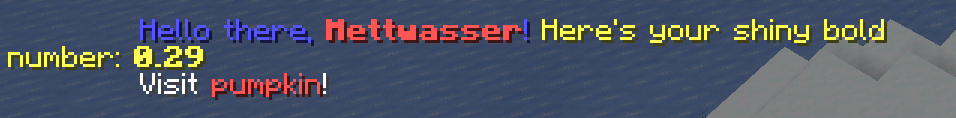

# minimessage

A (partial) implementation of minimessage for Pumpkin using a macro that checks the syntax at compile time!
The macro is fashioned just like `format!`.

```rs
minimessage!("<blue>Hello {}!</blue>", user.name);
```

## Small Demo

```rs
struct TestCommandHandler;

impl CommandHandler for TestCommandHandler {
    fn handle(
        &self,
        sender: pumpkin_plugin_api::command::CommandSender,
        _server: pumpkin_plugin_api::Server,
        _args: pumpkin_plugin_api::command::ConsumedArgs,
    ) -> pumpkin_plugin_api::Result<i32, pumpkin_plugin_api::command::CommandError> {
        let number = random::<f32>();

        sender.send_message(minimessage!(
            r#"
            <blue>Hello there, <red><bold>{}</bold></red>!</blue> <yellow>Here's your shiny bold number: <bold>{number:.2}</bold></yellow>
            <click:open_url:"https://pumpkinmc.org/">Visit <red>pumpkin</red>!</click>
            "#,
            sender.get_name()
        ));

        Ok(0)
    }
}
```



## Dynamic Rencering

Currently this isn't supported out of the box.
However, this library additionally provides a tokenizer and parser so you can DIY.

An example of how to use the tokenizer & parser:

```rs
fn get_nodes(input: &str) -> Vec<Node<'_>> {
    Parser::new(Tokenizer::new(input))
        .collect::<Result<Vec<_>>>()
        .unwrap()
}

let nodes = get_nodes(
    r"Hello <blue>{name}, welcome to <orange>Rust</orange>!</blue> with an escaped \{",
);

let expected = vec![
    Node::Text(Cow::Borrowed("Hello ")),
    Node::Element {
        tag: "blue",
        tag_descriptors: vec![],
        children: vec![
            Node::Expression(Expression::Named(Cow::Borrowed("name"))),
            Node::Text(Cow::Borrowed(", welcome to ")),
            Node::Element {
                tag: "orange",
                tag_descriptors: vec![],
                children: vec![Node::Text(Cow::Borrowed("Rust"))],
            },
            Node::Text(Cow::Borrowed("!")),
        ],
    },
    Node::Text(Cow::Owned(" with an escaped {".to_string())),
];

assert_eq!(nodes, expected);
```
